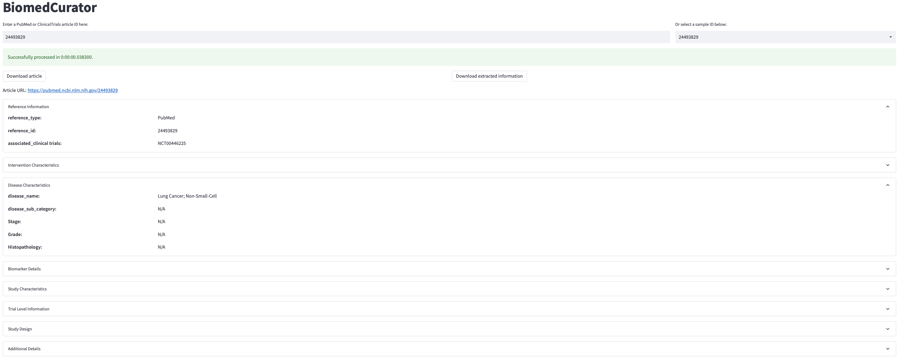
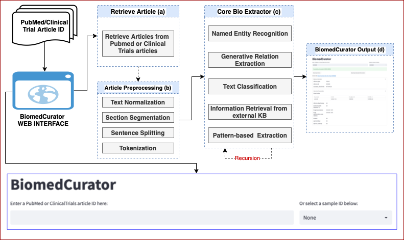
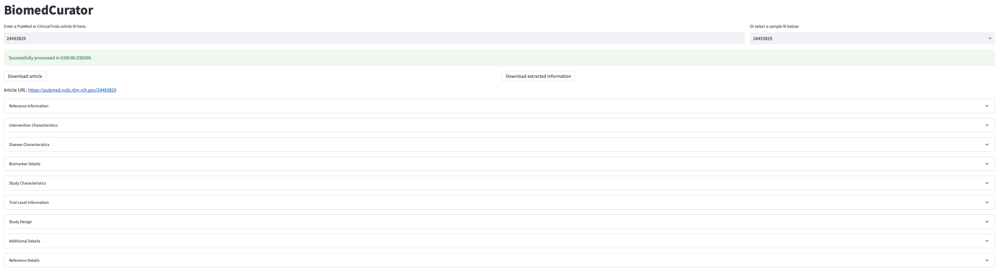
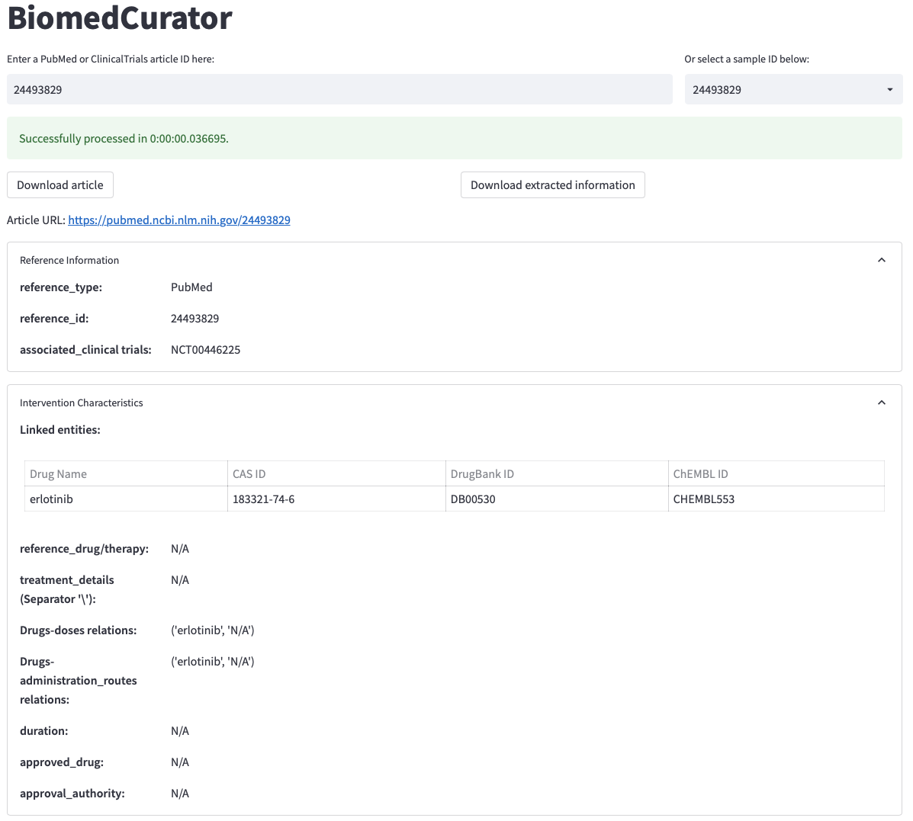

# BiomedCurator

- [Overview](#overview)
- [BiomedCurator DEMO](#biomedcurator-demo)
- [BiomedCurator Data-Set](#biomedcurator-dataset)
- [BiomedCurator Description](#biomedcurator-description)
- [Evaluation](#evaluation)
- [Acknowledgement](#acknowledgement)
- [Contact](#contact)
- [Citation](#citation)

<small><i><a href='http://ecotrust-canada.github.io/markdown-toc/'>Table of contents generated with markdown-toc</a></i></small>

# Overview

With the growth of data-driven science, the curation of public and community data sets has become a necessary task for ensuring the long-term usefulness of Biomedical domain. Scientific data typically comes in format with methodologies, experiment results, and the interpretation of those results and discussions in the form of statements. There are curation challenges in the form of scientific publications as to prevail most up-to-date structural data fields to create template. The task of biomedical data curation goes beyond fixing defects in data and annotate information based on related fields. Thus, curation must be done by human experts in the domain of the data, who are capable of interpreting the scientific literature, resolving conflicting interpretations, and reflecting the results in the data. In our BiomedCurator, several domain-specialist biologists are involved in the form of data curation from Pubmed and Clinical trial scientific articles as to create data template based on 61 fields of 11 categories ans sub-categories. We use this template as to train our model. 

# BiomedCurator DEMO
The BiomedCurator system provides a web interface to facilitate the process of creating, organising, and maintaining data sets so they can be accessed and used by researchers, biologists, or physiologist looking for information. In our demo, users can input a PubMed/ClinicalTrial id, the system involves detecting, collecting, linking, relation mapping, indexing, and classifing of entittes over the entire given article. 

Users can access our demo via [https://biomed-text.airc.aist.go.jp/biomedcurator/](https://biomed-text.airc.aist.go.jp/biomedcurator/).



# BiomedCurator Data-Set

We conduct experiments on our curated data-sets based on Pubmed and ClinicalTrials to address the biomedical data curation extraction tasks. The Pubmed and ClinicalTrials data-sets  consist of 2,570 and 2,371 pubmed and clinical trials related scientific articles respectively. Biologists are assigned to annotate the PubMed and ClinicalTrial data-sets based on 61 fields from 11 categories. We use the annotated templete to train our BiomedCurator model. The overview of categories, fields, description and related natural language processing techniques (NLPT) are illustrated below. The first and columns indicate category and its fields name. The third column stands for diffrent NLP approaches are applied in each field. In this column, PE, RE, EE, EL, and TC refer to pattern-based extraction, relation extrcation, entity extraction, entity linking, and text classification-based approaches are applied for data curation. Besides, fixed Value (FV) means N/A or a specific value in the curated data. Skip indicates some fields are skipped due to lack of training samples.

```
----------------------------------------------------------------------------------------------------------------------------------------------------------
Category                Field name                          NLPT    Description
----------------------------------------------------------------------------------------------------------------------------------------------------------
                        reference_type                      FV      Source of the article. Ex: PubMed or Clinical trial
Reference               reference_id                        PE      Unique Pubmed ID or Clinical trial id of the curated document
Information             associated_clinical trials          FV      Provides the associated clinicaltrial ids for which the results were published
                        s_no                                FV      Each assertion has given a unique number
----------------------------------------------------------------------------------------------------------------------------------------------------------                                 
                        drug/therapy                        RE      Captured the list of authors focus drug/s (substance intended for use in the cure, mitigation, treatment, or prevention of disease, to affect the structure or any function of the body or for use as a component of a medicine) of case group   
                        reference_drug/therapy              RE      Captured the list of authors focus drug/s (substance intended for use in the cure, mitigation, treatment, or prevention of disease, to affect the structure or any function of the body or for use as a component of a medicine) of reference group
                        treatment_details                   Skip    Detail description of the treatment, including but not limited to patient details, drug/therapy, dose/cycles, duration, route, schedule, analysis 
                        dose                                RE      It represents the concentration value of the drug used in the given reference
Intervention            route of administration             EL      The route through which the drug is administered
Characteristics         duration                            RE      Time period of the treatment
                        CAS id                              EL      Chemical abstracts service registry number of the drug
                        ChEMBL                              EL      Unique id as provided by ChEMBL
                        drug bank id                        EL      Drug bank id for the given drug
                        approved_drug                       Skip    Name of the drug which is approved by any approval authority
                        approval_authority                  Skip    Name of the organization (or) institution has the authority to approve the respective drug. Ex: FDA
----------------------------------------------------------------------------------------------------------------------------------------------------------           
                        disease_name                        NER+PE  Name of the focused indication for which the biomarker was studied
Disease                 disease_sub_category                NER+PE  Represents the subtype or any state of the disease mentioned in the given reference
Characteristics         Stage                               PE      Stages of the disease Eg: Stage I, II, III, IV, etc
                        Grade                               PE      Grading of the disease Eg: Grade I, II, III, IV, etc
                        Histopathology                      Skip    Additional details of the disease mentioned in the article Ex: Stage, grade, or histopathology etc.
----------------------------------------------------------------------------------------------------------------------------------------------------------                   
                        BNAMIR                              NER     Complete name of the biomarker. Abbreviations are extended for ease of understanding.
                        marker_type                         NER     Represents the type of the biomarker based on the techniques used to measure the biomarker Eg: Biochemical, Genomic etc.
                        marker_nature                       NER     Represents the chemical nature of the biomarker based on the techniques used to measure the biomarker Eg: Protein, Gene, Lipid etc.
                        Entrez id                           EL      Unique ID as provided by the NCBI Entrez gene database for each gene
Biomarker               Uniprot id                          EL      Protein accession number of UniprotKB database
Details                 type_of_variation                   PE      Represents standard HGVS (Human Genome Variation Society) constructs unique for each variation
                        rs_id                               EL      Represents the unique reference number for each SNP at a specific position. Taken from NCBI site – (dbSNP) Eg: rs763110
                        HGVS Name                           EL      Field describes nucleotide/DNA (c.) change as per the HGVS format (the nucleotide/genomic numbering should be as in article only)
----------------------------------------------------------------------------------------------------------------------------------------------------------
                        association                         TC      Describes about the high level type/category of biomarker association with outcomes. Associations are of 5 types: Gene - drug relationships; Gene - gene interactions; Gene - pathway relationships; Gene - phenotype relationships; Gene - transcript information
Biomarker               marker_alteration                   PE      Represents the type of alteration or measurement done for biomarker Eg: Gene expression, Polymorphism, Biomarker level etc.
association             type of alteration                  EL      Represents the modification of the marker mentioned in the article i.e change of biomarker expression or levels (the term is exactly taken from the article for user reference) . Eg: High; Low; Decreases; Association; Upregulation etc.
with outcomes           phenotype                           TC      Biomarker correlates or associates with any phenotype character, end point, outcome, any physiological process (which is direct indicator of the disease) and other biomarkers of the study sample 
                        phenotype_alteration                VF      Represents the state of change for the outcome variables which are associated with the studied biomarker
                        significance                        TC      Represents the level of significance of P value between different groups Eg: Non-significant or Significant
                        p_value                             FV      P value (Significance) between the different groups for comparison of biomarker result values or any other values related to biomarker. Ex: P=0.016
----------------------------------------------------------------------------------------------------------------------------------------------------------
                        application                         PE      Denotes the utility of the biomarker for a given condition in a specific reference (either clinical trial or pubmed article).  
Utility                 author_conclusion                   TC      Represents the utility of the biomarker from the author’s perspective in the given reference. Yes indicates that author, in the reference, supports the application of the biomarker for the given indication. No indicates that author in the reference does not support the application of the biomarker for the given indication.
                        evidence_statement                  Skip    Gives the structured description of the application text of the biomarker in a given condition specific to each reference and clinical status.
----------------------------------------------------------------------------------------------------------------------------------------------------------
                        study_type (Clinical/PreClinical)   EE      Represents the status of the clinical study Ex: Clinical, Preclinical etc
                        Cell line/ Model Name               FV      Represents the cell lines used in the preclinical model/It represents the preclinical model Eg: Mouse, rat etc
                        total_sample_number                 PE      Denotes total number of participants from both study and reference sample group in a particular study
Study                   patient_number (case)               PE      This field is used to capture the study group sample size for the curated assertion from the article
characteristics         patient_number (reference)          FV      This field is used to capture the reference group sample size for the curated assertion from the article
                        age (case)                          PE      Used to capture the study sample age from the article
                        gender (case)                       PE      Used to capture the gender for studied samples from the article
                        ethnicity (case)                    EE      This field represents the nationality/ethnicity of the study group as stated in the article
----------------------------------------------------------------------------------------------------------------------------------------------------------
                        trial_status                        Skip    Current stage of a clinical study. Ex: Completed, Terminated etc.
                        sponsor & collaborator              Skip    Sponsors/collaborators of the clinical study
Trial level             phase                               EE      Represents the clinical phase of the trial. Ex: 0, I, II, III, IV
information             inclusion_criteria                  Skip    Description on the Inclusion criteria for the patients in the clinical study
                        exclusion_criteria                  Skip    Description on the Exclusion criteria for the patients in the clinical study
----------------------------------------------------------------------------------------------------------------------------------------------------------
                        allocation                          PE      Assigning trial subjects to treatment or control groups. Ex: Non-randomized, Randomised
Study design            intervention_model                  Skip    Type of intervention model from the study. Ex: Single Group Design, Parallel Design, Crossover Design and Factorial Design
                        masking                             PE      Types of Masking include None, Open Label, Single Blind Masking and Double Blind Masking
                        primary_purpose                     Skip    Represents purpose of the study primarily under taken for the research
----------------------------------------------------------------------------------------------------------------------------------------------------------
Additional details      pathway_name                        FV      Names of the pathways in which a biomarker has a role. Taken from KEGG database
----------------------------------------------------------------------------------------------------------------------------------------------------------
                        Source                              FV      Represents whether the curated data is from full-text or abstract of the article or clinicaltrials
                        Title                               PE      Title of the article
Reference               Authors                             PE      Authors of the article
details                 Article/URL                         PE      Name of the journal or specific links from which the information is captured
                        Year                                PE      Year in which the given article published Ex: Article published year for Pubmed articles and First received year is considered for Clinicaltrials
----------------------------------------------------------------------------------------------------------------------------------------------------------
```

BNAMIR stands for biomarker_name_as_mentioned_in_reference
# BiomedCurator Description

## Introduction

We present BiomedCurator, an interactive web application that extracts the structural data from scientific Pubmed and ClinicalTrial data sets. BiomedCurator uses state-of-the-art natural language processing techniques to extract the information of PubMed and Clinical trial articles and fill the 61 fields including 11 categories and subcategories created by biologists.  The BiomedCurator web application that address text generation based model for relation extraction, entity detection and recognition, text classification model for extracting several fields using BigBird, information retrieval from external knowledge base to retrieve IDs,  and a pattern-based extraction approach that can extract several fields using regular expressions over the Pubmed and Clinical trial data-sets. 

## Usage of BiomedCurator
Annotation tasks like entity mention detection, relation extraction; extraction task like pattern- and knowledge-based extraction, and text clasifcation, can be performed using BiomedCurator for PubMed and ClinicalTrial articles that fills the 61 biomedical fields. 

## BiomedCurator System
BiomedCurator system mainly comprises two platforms: BiomedCurator web interface and BiomedCurator back-end server. The overall workflow of the BiomedCurator system is illustrated as below.



### BiomedCurator Web Interface
In [BiomedCurator web interface](#biomedcurator-demo), the user interface contains input panel, Enter a PubMed or ClinicalTrailas article ID here tab, Or select a sample ID below tab. For a given PubMed/ClinicalTrail ID from users or loading a sample text from a sample list, the output panel show the information of 61 fields based on pretrained BiomedCurator model. 


In the result box,the users will able to download article from Download Article tab, or can extract information from the Download extracted information tab in plain text and JSON formats. The system will also provide the reference article URL for user reference. The BiomedCurator also shows the processing time from user input to result box through the backend models.



The results are organized into sections. The user can click on the "V/Ʌ" button to expand/minimize its content.
For example, the Intervention Characteristics section shows relations between Drug and Dose extracted from the article.



### BiomedCurator Back-end
The BiomedCurator back-end is for storing tools (e.g., NER, relatuion extraction based on generation model, classification model, pattern- and knowledge-based information extraction models) that transform into a pipeline. 

#### Neural Named Entity Recognition
In the named entity recognition (NER) task, two pre-trained NER models based on general and biomedical dataset are used.  
We use the well-known spaCy NER model pre-trained on OntoNotes 5 dataset to extract the required information to fill the **ethnicity** field in our system. In contrast to fill the **Biomarker_name** field, the Spacy NER model pre-trained on BioNLP13CG is used. 

#### Generative Relation Extraction
In the geenrative-based relation extraction, currently we are formalizing binary relation extraction task as a template generation problem. For a given paragraph, we expect to train a model that can generate a sequence in our predefined structure so called templates. For the sequence-to-sequence model, we utilize the [BigBird](https://arxiv.org/abs/2007.14062) model that can process up to 8x longer sequence than BERT. Therefore, for the sequence-to-sequence model, we utilize the Big Bird model to extract the relations from a given paragraph which is an input to the [BigBird](https://arxiv.org/abs/2007.14062) model.

## Summary
We presented the **BiomedCurator** system for entity detection, relation extraction, entity linking, information extraction based on pattern and knowledge base, hoping that we can bring insights for the biomedical studies on making scientific discoveries. The **BiomedCurator** system is continually evolving; we will continue to improve the system as well as to implement new functions such as n-ary relation extraction to further facilitate **BiomedCurator** research.

# Acknowledgement
This work is based on results obtained from a project commissioned by the Public/Private R&D Investment Strategic Expansion PrograM ([PRISM](https://www.nibiohn.go.jp/prism/about/))

# Contact
* [Mohammad Golam Sohrab](https://orcid.org/0000-0001-5540-7834): sohrab.mohammad@aist.go.jp
* Khoa N. A. Duong
* Goran Topić
* Nogami-Itoh
* Masataka Kuroda
* Yayoi Natsume-Kitatani
* Masami Ikeda
* Hiroya Takamura

# Citation
If you find this work helpful, please use the following citation:

```
@inproceedings{biomed_curator_2022,
    title = "BiomedCurator: Data Curation for Biomedical Literature",
    author = "Mohammad Golam Sohrab, Khoa N. A. Duong, Masami Ikeda, Goran Topić, Yayoi Natsume-Kitatani, Masakata Kuroda, Mari Nogami Itoh, Hiroya Takamura",
    booktitle = "The 2nd Conference of the Asia-Pacific Chapter of the Association for Computational Linguistics",
    month = "November",
    year = "2022",
    address = "Online",
    publisher = "The Asia-Pacific Chapter of the Association for Computational Linguistics",
    url = "To appear",
    pages = "To appear",
} 
```

Thanks!!!
