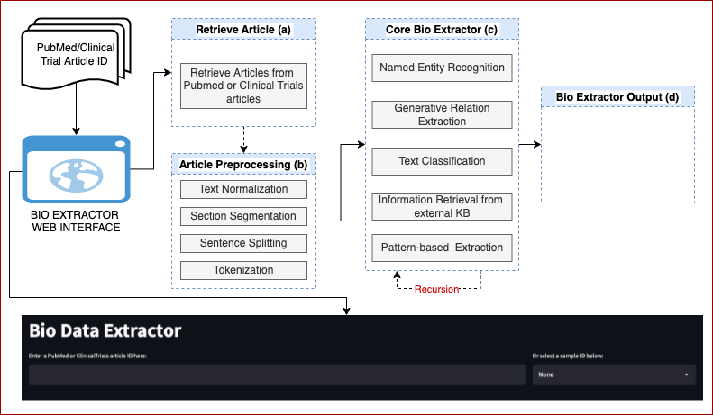

# BioMedCurator

- [Overview](#overview)
- [BioMedCurator DEMO](#biomedcurator-demo)
- [BioMedCurator Data Set](#biomedcurator-dataset)
- [BioMedCurator Description](#biomedcurator-description)
- [Evaluation](#evaluation)
- [Acknowledgement](#acknowledgement)
- [Contact](#contact)
- [Citation](#citation)

<small><i><a href='http://ecotrust-canada.github.io/markdown-toc/'>Table of contents generated with markdown-toc</a></i></small>

# Overview

With the growth of data-driven science, the curation of public and community data sets has become a necessary task for ensuring the long-term usefulness of Biomedical domain. Scientific data typically comes in format with methodologies, experiment results, and the interpretation of those results and discussions in the form of statements. There are curation challenges in the form of scientific publications as to prevail most up-to-date structural data fields to create template. The task of biomedical data curation goes beyond fixing defects in data and annotate information based on related fields. Thus, curation must be done by human experts in the domain of the data, who are capable of interpreting the scientific literature, resolving conflicting interpretations, and reflecting the results in the data. In our BioMedCreator, several domain-specialist biologists are involved in the form of data curation from Pubmed and Clinical trial scientific articles as to create data template based on 61 fields of 11 categories ans sub-categories. We use this template as to train our model. 

# BioMedCurator DEMO
The BioMedCurator system provides a web interface to facilitate the process of creating, organining, and mainitaining data sets so they can be accessed and used by researchers, biologists, or physiologist looking for information. In our demo, users can input a PubMed/ClinicalTrial id, the system involves detecting, collectiong, linking, ralation mapping, indexing, and classifing of entittes over the entire given article. 

Users can access our demo via [http://underconstruction/biomedcurator/](http://underconstruction/biomedcurator/).


# BioMedCurator Data Set

We conduct experiments on our curated data-sets based on Pubmed and ClinicalTrials to address the biomedical data curation extraction tasks. The Pubmed and ClinicalTrials data-sets  consist of 2,570 and 2,371 pubmed and clinical trials related scientific articles respectively. Biologists are assigned to annotate the entire PubMed and ClinicalTrial data-sets based on 61 fields. We use the annotated templete to train our BioMedCurator model.

## Sample Data Format of BioMedCurator 
Examples of annotation for an entity (**T**), a relation (**R**) are shown in the following. Text-bound annotation identifies a specific span of text and assigns it a type. In text-bound annotation (**T1**) of a span “**Cilengitide**”,  where type is **drug/therapy**. The relation annotation (**R1**) where the text-bound annotation (**T1**) has a realtion to text-bound annotation (**T2**). Entites are detected based on the reference annotated templete created by biologists.  
```
    T1	drug/therapy	Cilengitide
    T2	dose	600 mg/m2   
    R1  T1  T2
    T3	drug/therapy	Docetaxel
    T4	dose	75 mg/m2  
    R2  T3  T4
    T5	drug/therapy	Docetaxel
    T6	dose	75 mg/m2 
    R3  T5  T6
    T7	drug/therapy	Cilengitide
    T8	dose	240 mg/m2 
    R4  T7  T8
    T9	drug/therapy	Cilengitide
    T10	dose	400 mg/m2 
    R5  T11  T10
    T11	drug/therapy	Cilengitide
    T12	dose	600 mg/m2
    R6  T11  T12
    T13	drug/therapy	Docetaxel
    T14	dose	75 mg/m2 
    R7  T13  T14
    T15	drug/therapy	Cilengitide
    T16	dose	240 mg/m2 
    R8  T15  T16
    T17	drug/therapy	Cilengitide
    T18	dose	400 mg/m2 
    R9  T17  T18
    T19	drug/therapy	Cilengitide
    T20	dose	600 mg/m2
    R10  T19  T20
    T21	drug/therapy	Docetaxel
    T22	dose	75 mg/m2 
    R11  T21  T22
    T23	drug/therapy	Cilengitide|Docetaxel
    T24	dose	240 or 400 or 600 mg/m2 (Cilengitide)|75 mg/m2 (Docetaxel) 
    R12  T23  T24
    T25	drug/therapy	Cilengitide|Docetaxel
    T26	dose	240 or 400 or 600 mg/m2 (Cilengitide)|75 mg/m2 (Docetaxel) 
    R13  T25  T26
    T27	drug/therapy	Cilengitide|Docetaxel
    T28	dose	240 or 400 or 600 mg/m2 (Cilengitide)|75 mg/m2 (Docetaxel)
    R14  T27  T28
```

# BioMedCurator Description

## Introduction

We present BioMedCurator, an interactive web application that extracts the structural data from scientific Pubmed and ClinicalTrial data sets. BioMedCurator uses state-of-the-art natural language processing techniques to extract the information of PubMed and Clinical trial articles and fill the 61 fields including 11 categories and subcategories created by biologists.  The BioMedCurator web application that address text generation based model for relation extraction, entity detection and recognition, text classification model for extracting several fields using BigBird, information retrieval from external knowledge base to retrieve IDs,  and a pattern-based extraction approach that can extract several fields using regular expressions over the Pubmed and Clinical trial data-sets. 

## Usage of BioMedCurator
Annotation tasks like entity mention detection, relation extraction; extraction task like pattern- and knowledge-based extraction, and text clasifcation, can be performed using BioMedCurator for PubMed and ClinicalTrial articles that fills the 61 biomedical fields. 

## BioMedCurator System
BioMedCurator system mainly comprises two platforms: BioMedCurator web interface and BioMedCurator back-end server. The overall workflow of the BioMedCurator system is illustrated as below.



### BioMedCurator Web Interface
In [BioMedCurator web interface](#biomedcurator-demo), the user interface contains input panel, Enter a PubMed or ClinicalTrailas article ID here tab, Or select a sample ID below tab. For a given PubMed/ClinicalTrail ID from users or loading a sample text from a sample list, the output panel show the information of 61 fields based on pretrained BioMedCurator model. The users will able to download article from Download Article tab, or can extract information from the Download extracted information tab. The system will also provide the reference article URL for user reference. 

### BioMedCurator Back-end
The BioMedCurator back-end is for storing tools (e.g., NER, relatuion extraction based on generation model, classification model, pattern- and knowledge-based information extraction models) that transform into a pipeline. 

#### Neural Named Entity Recognition
Named entity recognition (NER) is a task of finding entities with specific semantic types such as Protein, Cell, and RNA in text. We build neural NER model, based on the [BERT](https://www.aclweb.org/anthology/N19-1423.pdf) model. The layer receives subword sequences and assigns contextual representations to the subwords via BERT. 

#### Generative Relation Extraction
In the geenrative-based relation extraction, currently we are formalizing binary relation extraction task as a template generation problem. For a given paragraph, we expect to train a model that can generate a sequence in our predefined structure so called templates. For the sequence-to-sequence model, we utilize the [Big Bird](https://arxiv.org/abs/2007.14062) model that can process up to 8x longer sequence than BERT. Therefore, for the sequence-to-sequence model, we utilize the Big Bird model to extract the relations from a given paragraph which is an input to the Big Bird model.

## Summary
We presented the **BioMedCurator** system for entity detection, relation extraction, information extraction based on pattern and knowledge base, hoping that we can bring insights for the biomedical studies on making scientific discoveries. The **BioMedCurator** system is continually evolving; we will continue to improve the system as well as to implement new functions such as n-ary relation extraction to further facilitate **BioMedCurator** research.

# Evaluation

## TODO

We evaluate our BioMedCurator system from several aspects: TODO 

# Acknowledgement
This work is based on results obtained from a project commissioned by the Public/Private R&D Investment Strategic Expansion PrograM (PRISM)

# Contact
* [Mohammad Golam Sohrab](https://orcid.org/0000-0001-5540-7834): sohrab.mohammad@aist.go.jp
* Khoa N. A. Duong
* Goran Topić
* Nogami-Itoh
* Masataka Kuroda
* Yayoi Natsume-Kitatani
* Masami Ikeda
* Hiroya Takamura

# Citation
If you find this work helpful, please use the following citation:

```
@inproceedings{biomed_curator_2022,
    title = "BioMedCurator: an Interactive Web Application for Template Generation from Biomedical Literature",
    author = "To be appeared",
    booktitle = "To be appeared",
    month = To be appeared,
    year = "To be appeared",
    address = "Online",
    publisher = "To be appeared",
    url = "To be appeared",
    pages = "To be appeared",
} 
```

Thanks!!!
